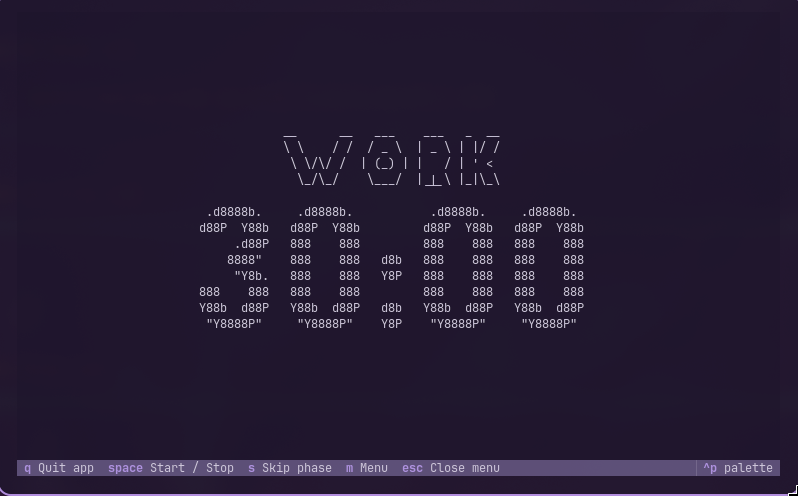

# omarchy-pomo

A Pomodoro timer for [Omarchy](https://omarchy.org/) — a background daemon, a Waybar module, and a Textual TUI, all sharing state over a local Unix socket.



## Features

- **Daemon** — tracks work/break phases in the background via `systemd --user`, survives logout of the TUI, and fires a desktop notification (`notify-send`) whenever a phase ends.
- **Waybar module** — shows the current phase and countdown (💻️ work / 🧘‍♂ break) in your bar. Left-click to start/pause, right-click to open the TUI.
- **TUI** — a full-screen Textual view with a giant figlet clock, start/pause/skip, and a menu for adjusting work/break durations on the fly. Automatically picks up your current [Omarchy theme colors](https://omarchy.org/).
- Everything talks over a single Unix socket (`/tmp/pomodoro.sock`), so the daemon, Waybar, TUI, and CLI all see the same state at all times.

## Install

```bash
curl -fsSL https://raw.githubusercontent.com/yorancroes/omarchy-pomo/main/install.sh | bash
```

Or clone first and run it locally:

```bash
git clone https://github.com/yorancroes/omarchy-pomo.git
cd omarchy-pomo
./install.sh
```

`install.sh` is idempotent — re-run it any time (e.g. after `git pull`) to pick up changes. It will:

- create a virtualenv and install Python dependencies (`textual`, `pyfiglet`)
- install and enable the `pomodoro_timer` `systemd --user` service, restarting it if the daemon source changed
- add a `custom/pomodoro` module to `~/.config/waybar/config.jsonc` (and a bit of extra spacing to `style.css`) if Waybar is detected
- add a Hyprland window rule so the TUI opens floating and centered, if Hyprland is detected

Every edit it makes to your own config files is a surgical, marker-based patch, and the previous version is backed up alongside it (`*.bak.<timestamp>`) before anything is touched.

### Requirements

- Python 3.12+
- `systemd --user`
- Waybar and Hyprland are optional — the daemon and CLI work standalone; install.sh just skips the integrations it can't detect.

## Usage

| Where | Action |
|---|---|
| Waybar | **Left-click** — start/pause the timer |
| Waybar | **Right-click** — open the full TUI |
| TUI | `space` start/pause · `s` skip phase · `m` toggle settings menu · `escape` close menu · `q` quit |
| Terminal | `python3 <install-dir>/src/cli.py <start\|pause\|skip>` |

The TUI's settings menu (`m`) lets you type in new work/break durations in minutes, applied immediately to the running timer.

## How it works

```
        ┌──────────────┐   /tmp/pomodoro.sock   ┌───────────────┐
        │  daemon.py   │◄──────────────────────►│  cli.py / TUI │
        │ (systemd     │                         │  waybar_timer │
        │  --user)     │                         └───────────────┘
        └──────┬───────┘
               │ writes every second
               ▼
   /tmp/pomodoro_state.json  ──►  read by the TUI and the Waybar module
```

- The **daemon** owns the timer state and is the only writer — it advances phases, sends notifications, and dumps state to `/tmp/pomodoro_state.json` once a second.
- **Commands** (`start`, `pause`, `skip`, `change_pomo`, `change_break`) go over the Unix socket at `/tmp/pomodoro.sock` and are handled by the daemon.
- The **TUI** and **Waybar module** only read the JSON state file to render — they never touch timer logic themselves.

## Uninstall

```bash
systemctl --user disable --now pomodoro_timer.service
rm ~/.config/systemd/user/pomodoro_timer.service
```

Then remove the `custom/pomodoro` block from `~/.config/waybar/config.jsonc` and the `omarchy-pomo` window rule from `~/.config/hypr/hyprland.conf` (both are clearly marked `# managed by install.sh`).

## License

[MIT](LICENSE)
